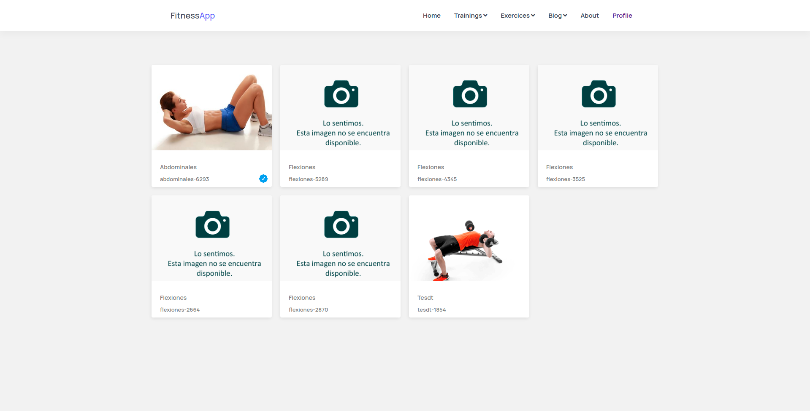
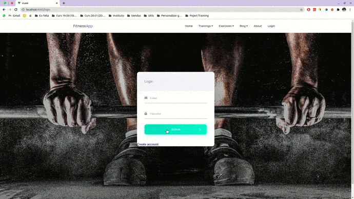
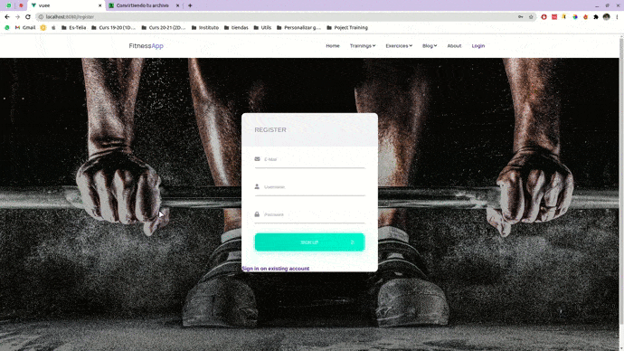
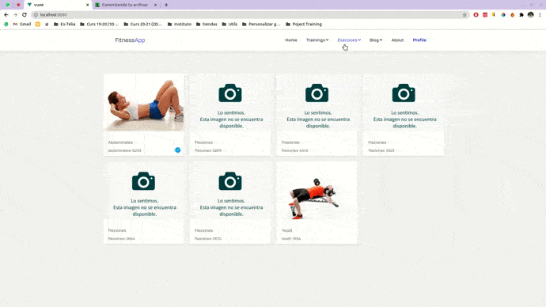
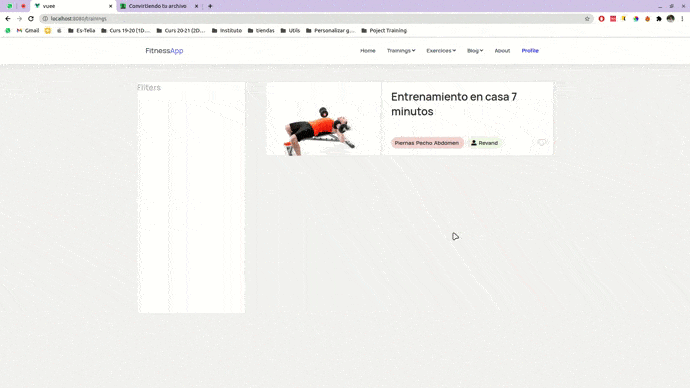
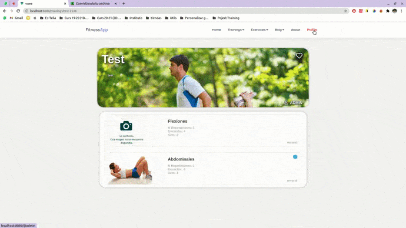
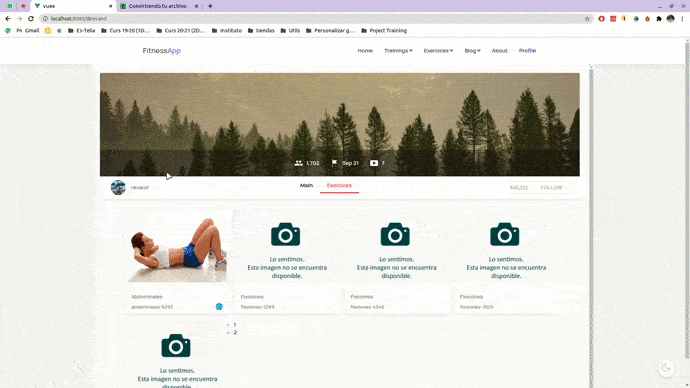

# Vue_React_Django

## Preview 📷
All the images shown below are provisional and will not be the final aspect of the web application:
### Homepage

### Login

### Register

### Exercices Details - Create - Delete

### Trainings Details - Create - Delete

### Update Profile

### Follows


## Getting Started

For run the code on your local machine and be able to observe the latest changes you need to install Docker/Docker-Compose.

## Prerequisites

You must have **docker** and **docker-compose** installed on your machine. For install docker correctly, realize the following steps:

[How to install docker (Official Website)](https://docs.docker.com/engine/install/ubuntu/)

Next, you must have a specific version of docker-compose, since the previous ones contain a bug that does not allow the correct operation of the app. Realize the following steps:

```
sudo curl -L "https://github.com/docker/compose/releases/download/1.27.4/docker-compose-$(uname -s)-$(uname -m)" -o /usr/local/bin/docker-compose
```
```
sudo chmod +x /usr/local/bin/docker-compose
```
```
sudo docker-compose --version
```

## Installation

We run `docker-compose up` (version 1.27) and wait for the containers to start.

Once we start we enter the django container and carry out the migrations
`python3 manage.py migrate`

We create a superuser
`python3 manage.py createsuperuser`

Then we will have to create a category from Postman
API: `"localhost:8000/api/fitness/category"`

``` 
{
  "name": "Chest",
  "image": "https://www.deportesaludable.com/wp-content/uploads/2019/02/pecho.jpg"
} 
```


### Features:

| Module | Description |
| --- | --- |
| Home | Main page of the application where you can see the latests exercices |
| Trainings | Here you can create and list workouts |
| Exercices | Here you can create and list exercises that you can use in your workouts |
| Login | Login module with local users |
| Profile | In this module you can see your exercices, change your profile information and follows other users |


### Built with 🛠️
* [VUE](https://vuejs.org/)
* [Django](https://www.djangoproject.com/)
* [Postgresql](https://www.postgresql.org/)

## Other technologies
* [Docker](https://www.docker.com)
* [JWT](https://jwt.io/)
* [VUEX](https://vuex.vuejs.org/)


Co-authored-by: Vicente Andani <andanivicente@gmail.com>
Co-authored-by: Joel Revert <jrevertvila@gmail.com>
